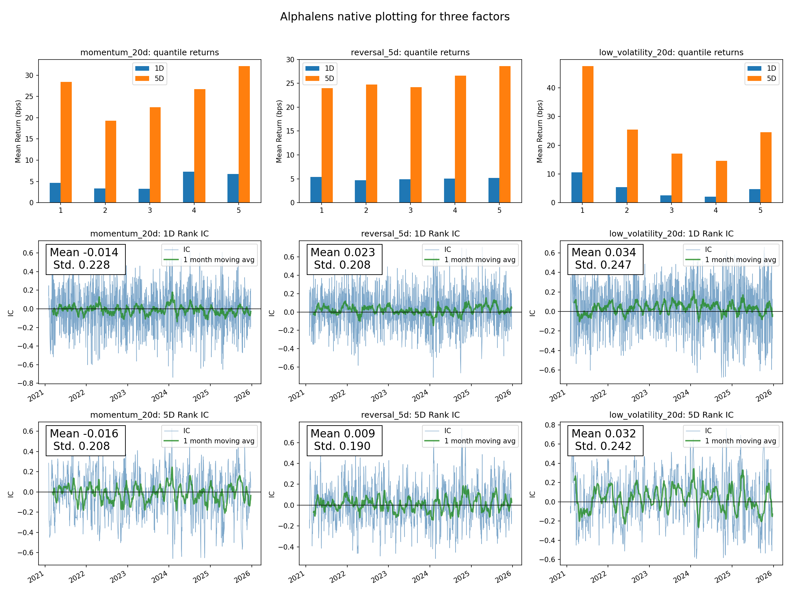
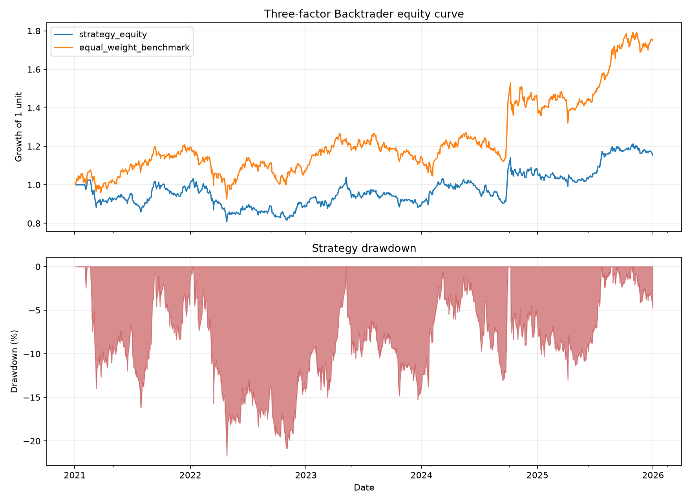
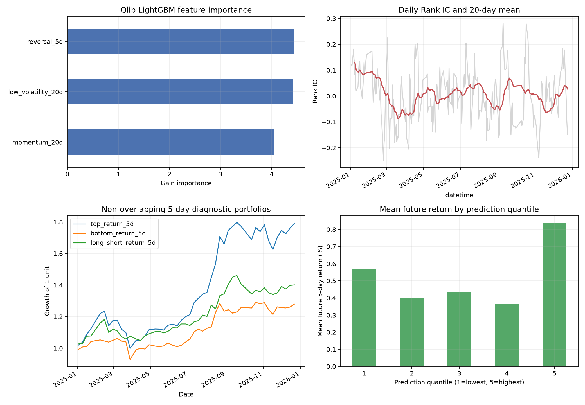

# Alphalens Backtrader Qlib 三因子学习项目

这是一个面向 GitHub 和 Python 初学者的量化研究练习。项目使用 Tushare 提供的真实沪深 300 前复权收盘价，围绕同一组三个因子依次完成：

1. 用 Alphalens 检查因子与未来收益之间的统计关系；
2. 用 Backtrader 把三个因子变成调仓规则并回测；
3. 用 Qlib 和 LightGBM 学习三个因子的非线性组合。

本项目不会自动生成随机股票价格。真实行情文件缺失时，三个主程序会直接报错。Qlib 中的随机种子只用于让模型训练结果可复现，不会制造或修改行情。

## 三个因子

- 20 日动量：`P(t) / P(t-20) - 1`，过去 20 日涨幅越大，因子越高。
- 5 日反转：`-(P(t) / P(t-5) - 1)`，近期跌得越多，因子越高。
- 20 日低波动：`-Std(日收益率, 20 日)`，波动越低，因子越高。

## 目录结构

```text
quant-finance-three-libs/
├─ labs/
│  ├─ alphalens/      # 因子诊断、Tushare 下载程序和基础测试
│  ├─ backtrader/     # 三因子组合回测和基础测试
│  └─ qlib/           # Qlib 数据集、LightGBM 模型和基础测试
├─ data/
│  └─ tushare_csi300/ # 真实行情放在这里，GitHub 中不保存数据本体
├─ docs/              # Word、PDF 学习手册及上游仓库说明
├─ requirements/      # 三套独立 Python 环境的依赖清单
├─ results/           # 体积较小的关键指标和结果图
└─ quant_finance.code-workspace
```

## 为什么不把三个官方仓库完整复制进来

本仓库保存的是我们针对三个库编写的实验代码，而不是再次发布第三方项目的全部源码。这样可以避免仓库过大、版本混乱和许可证边界不清。三个官方仓库地址、安装方法和阅读入口写在 [docs/UPSTREAM_REPOSITORIES.md](docs/UPSTREAM_REPOSITORIES.md) 中。

## 第一次使用

建议先安装 VS Code 的 Microsoft Python 扩展，然后在本目录打开 `quant_finance.code-workspace`。三个库依赖冲突较多，因此各自使用一个虚拟环境，不需要反复修改同一个 `launch.json`。

在 PowerShell 中，从项目根目录依次执行：

```powershell
py -3.8 -m venv .venv-alphalens
.\.venv-alphalens\Scripts\python.exe -m pip install -U pip setuptools wheel
.\.venv-alphalens\Scripts\python.exe -m pip install -r requirements\alphalens.txt

py -3.11 -m venv .venv-backtrader
.\.venv-backtrader\Scripts\python.exe -m pip install -U pip
.\.venv-backtrader\Scripts\python.exe -m pip install -r requirements\backtrader.txt

py -3.11 -m venv .venv-qlib
.\.venv-qlib\Scripts\python.exe -m pip install -U pip
.\.venv-qlib\Scripts\python.exe -m pip install -r requirements\qlib.txt
```

如果电脑没有 `py -3.8`，可以安装 Miniconda，并为 Alphalens 创建 Python 3.8 环境。Alphalens 是较老的项目，在新版本 Python 上可能无法安装。

## 下载真实数据

1. 把 `labs/alphalens/.env.example` 复制为 `labs/alphalens/.env`。
2. 在 `.env` 中填入自己的 Tushare Token。不要把该文件提交到 GitHub。
3. 在 VS Code 左侧选择 `02 Alphalens`，按 F5。
4. 选择“下载Tushare真实沪深300数据”。
5. 下载完成后，应看到 `data/tushare_csi300/csi300_qfq_close_2021_2025.csv`。

数据目录中的 [README.md](data/tushare_csi300/README.md) 说明了四个下载产物及价格口径。

## 运行三个实验

按照以下顺序运行，便于先理解因子，再理解交易和模型：

1. `02 Alphalens`：按 F5，选择“真实数据：运行三个因子分析”。
2. `01 Backtrader`：按 F5，选择“真实数据：Backtrader三因子回测”。
3. `03 Qlib`：按 F5，选择“真实数据：Qlib三因子模型”。

程序会弹出图形窗口。查看完图后关闭窗口，程序才会结束。运行结果默认保存在项目根目录新生成的 `output/` 下。

## 基础测试

每个实验目录都有一个小测试文件：

- `labs/alphalens/alphalens_test.py`
- `labs/backtrader/backtrader_test.py`
- `labs/qlib/qlib_test.py`

这些测试用于确认解释器和库是否配置正确。Alphalens 测试也只使用已下载的真实行情，不生成随机价格。

## 当前示例结果

`results/` 保存了本项目一次完整运行的关键结果：

- Alphalens：三个因子的 Rank IC、分组收益和诊断图；
- Backtrader：资金曲线、回撤、绩效指标和调仓记录；
- Qlib：测试集 Rank IC、特征重要性、预测分组收益和诊断图。

### Alphalens 因子诊断



### Backtrader 回测结果



### Qlib 模型结果



这些结果用于复核代码是否能运行，不代表未来收益，也不构成投资建议。样本固定使用 2025 年末成分股，存在生存者偏差；Backtrader 示例只有收盘价，不能完整模拟下一日开盘、停牌和涨跌停。

## 学习资料

优先阅读 `docs/三个量化库三因子实战学习手册.pdf`。手册逐段解释数据、因子公式、三个主程序的函数结构、结果含义、VS Code 运行方法和研究限制。Word 版本可用于做笔记或继续编辑。

## 上传到 GitHub

上传前按照 [GITHUB_UPLOAD_CHECKLIST.md](GITHUB_UPLOAD_CHECKLIST.md) 检查一次。最重要的规则是：不要提交 `.env`、Tushare Token、虚拟环境和大体积行情文件。
